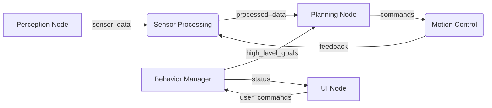

# Chapter 1: ROS 2 as the Robotic Nervous System

## Introduction

Just as the human nervous system enables coordinated movement, sensory perception, and cognitive processing across the body, Robot Operating System 2 (ROS 2) serves as the distributed nervous system for humanoid robots. This chapter establishes the conceptual foundation for understanding ROS 2 as the middleware backbone that enables distributed robot cognition and coordinated behavior.

## The Biological Analogy

### Human Nervous System Components

The human nervous system consists of:
- **Central processing**: Brain and spinal cord for decision-making and coordination
- **Communication pathways**: Neural networks transmitting signals throughout the body
- **Sensory inputs**: Eyes, ears, touch sensors providing environmental awareness
- **Motor outputs**: Muscles and effectors executing physical actions
- **Feedback loops**: Continuous monitoring and adjustment of behavior

### ROS 2 Equivalents

Similarly, ROS 2 provides:
- **Nodes**: Distributed processing units equivalent to neurons and brain regions
- **Topics**: Communication pathways for continuous data flow (like neural signals)
- **Services/Actions**: Synchronous and long-running communication patterns
- **Sensors**: Interface with cameras, IMUs, force sensors, etc.
- **Actuators**: Control of motors, grippers, and other effectors
- **Parameters**: Configuration and state management across the system

## Why ROS 2 is Essential for Physical AI and Humanoid Robots

### Distributed Cognition Requirements

Humanoid robots require distributed processing capabilities because:

1. **Real-time constraints**: Different subsystems have varying timing requirements
2. **Computational complexity**: Vision, planning, and control require specialized processing
3. **Modularity**: Independent development and testing of robot capabilities
4. **Scalability**: Ability to add new sensors, actuators, and capabilities

### Advantages Over Monolithic Systems

Traditional monolithic robot control systems face several limitations:

- **Single point of failure**: One component failure can disable the entire robot
- **Scalability challenges**: Adding new capabilities requires modifying the entire system
- **Development bottlenecks**: All development must be coordinated through a single system
- **Testing complexity**: Difficult to test components in isolation

ROS 2 addresses these challenges through:

- **Decentralized architecture**: Independent nodes can continue operating during partial failures
- **Component-based design**: New capabilities can be added without modifying existing components
- **Parallel development**: Teams can work on different nodes simultaneously
- **Modular testing**: Components can be tested in isolation or with simulated environments

## Core ROS 2 Architecture

### Nodes and the Communication Graph

In ROS 2, a **node** is an executable process that participates in the communication graph. Nodes can:

- Publish data to topics
- Subscribe to topics to receive data
- Provide services to respond to requests
- Act as service clients to make requests
- Execute or monitor actions for long-running tasks

The communication graph represents all the connections between nodes:



### DDS (Data Distribution Service)

ROS 2 uses DDS as its underlying communication middleware, providing:

- **Publisher-subscriber pattern**: Asynchronous, decoupled communication
- **Service calls**: Synchronous request-response communication
- **Discovery**: Automatic discovery of nodes and their interfaces
- **Quality of Service (QoS)**: Configurable reliability, durability, and performance settings

### Communication Primitives Overview

1. **Topics**: For continuous data streams (sensors, state)
2. **Services**: For request-response interactions (transform lookup, planning)
3. **Actions**: For long-running tasks with feedback (navigation, manipulation)

## Comparison with Traditional Systems

### Monolithic Architecture
```
┌─────────────────────────────────────┐
│        Single Executable            │
│                                     │
│  Perception ←→ Planning ←→ Control  │
│      ↓         ↓         ↓          │
│   Sensors   Decision   Actuators    │
│             Making                  │
└─────────────────────────────────────┘
```

### ROS 2 Distributed Architecture
```
┌─────────────┐    ┌─────────────┐    ┌─────────────┐
│  Perception │    │   Planning  │    │   Control   │
│    Node     │    │    Node     │    │    Node     │
└──────┬──────┘    └──────┬──────┘    └──────┬──────┘
       │                  │                  │
       └──────────────────┼──────────────────┘
                          │
                   ┌──────▼──────┐
                   │   DDS       │
                   │ Middleware    │
                   └──────┬──────┘
                          │
            ┌─────────────┼─────────────┐
            ▼             ▼             ▼
    ┌─────────────┐ ┌─────────────┐ ┌─────────────┐
    │   Sensor    │ │   UI/       │ │   Actuator  │
    │   Node      │ │   Monitor   │ │   Node      │
    └─────────────┘ └─────────────┘ └─────────────┘
```

## Summary

ROS 2 serves as the distributed nervous system for humanoid robots, enabling:

- Decentralized processing and decision-making
- Flexible communication patterns for different use cases
- Scalable architecture that can grow with robot capabilities
- Independent development and testing of robot subsystems

In the next chapter, we'll explore the specific communication primitives that enable this distributed architecture.