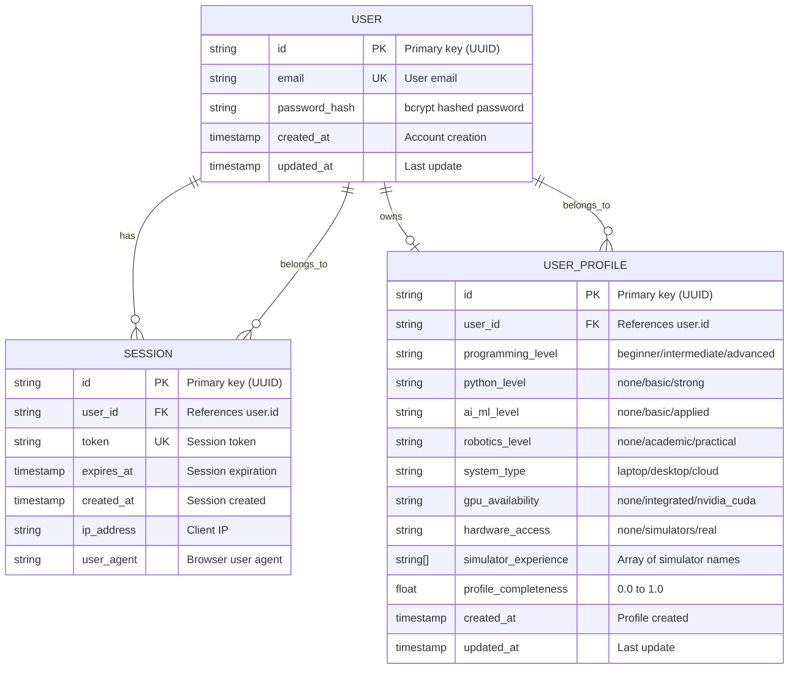

# Data Model: User Authentication & Background-Aware Personalization

**Feature**: 002-user-auth | **Date**: 2025-12-30

## Entity Relationship Diagram



## Database Schema (SQL)

### Users Table (Managed by Better Auth)

```sql
CREATE TABLE IF NOT EXISTS "user" (
    "id" TEXT PRIMARY KEY,
    "email" TEXT NOT NULL UNIQUE,
    "password_hash" TEXT NOT NULL,
    "created_at" TIMESTAMP WITH TIME ZONE DEFAULT NOW(),
    "updated_at" TIMESTAMP WITH TIME ZONE DEFAULT NOW()
);

CREATE INDEX IF NOT EXISTS idx_user_email ON "user"("email");
```

### Sessions Table (Managed by Better Auth)

```sql
CREATE TABLE IF NOT EXISTS "session" (
    "id" TEXT PRIMARY KEY,
    "user_id" TEXT NOT NULL REFERENCES "user"("id") ON DELETE CASCADE,
    "token" TEXT NOT NULL UNIQUE,
    "expires_at" TIMESTAMP WITH TIME ZONE NOT NULL,
    "created_at" TIMESTAMP WITH TIME ZONE DEFAULT NOW(),
    "ip_address" TEXT,
    "user_agent" TEXT,
    CONSTRAINT fk_user FOREIGN KEY ("user_id") REFERENCES "user"("id")
);

CREATE INDEX IF NOT EXISTS idx_session_user_id ON "session"("user_id");
CREATE INDEX IF NOT EXISTS idx_session_token ON "session"("token");
CREATE INDEX IF NOT EXISTS idx_session_expires ON "session"("expires_at");
```

### User Profiles Table (Custom)

```sql
CREATE TABLE IF NOT EXISTS "user_profile" (
    "id" TEXT PRIMARY KEY,
    "user_id" TEXT NOT NULL REFERENCES "user"("id") ON DELETE CASCADE,
    "programming_level" TEXT CHECK ("programming_level" IN ('beginner', 'intermediate', 'advanced')),
    "python_level" TEXT CHECK ("python_level" IN ('none', 'basic', 'strong')),
    "ai_ml_level" TEXT CHECK ("ai_ml_level" IN ('none', 'basic', 'applied')),
    "robotics_level" TEXT CHECK ("robotics_level" IN ('none', 'academic', 'practical')),
    "system_type" TEXT CHECK ("system_type" IN ('laptop', 'desktop', 'cloud')),
    "gpu_availability" TEXT CHECK ("gpu_availability" IN ('none', 'integrated', 'nvidia_cuda')),
    "hardware_access" TEXT CHECK ("hardware_access" IN ('none', 'simulators', 'real')),
    "simulator_experience" TEXT[],
    "profile_completeness" REAL DEFAULT 0.0,
    "created_at" TIMESTAMP WITH TIME ZONE DEFAULT NOW(),
    "updated_at" TIMESTAMP WITH TIME ZONE DEFAULT NOW(),
    CONSTRAINT fk_user FOREIGN KEY ("user_id") REFERENCES "user"("id")
);

CREATE INDEX IF NOT EXISTS idx_user_profile_user_id ON "user_profile"("user_id");
CREATE INDEX IF NOT EXISTS idx_user_profile_completeness ON "user_profile"("profile_completeness");
```

## TypeScript Interfaces

```typescript
// User entity
interface User {
  id: string;
  email: string;
  passwordHash: string;
  createdAt: Date;
  updatedAt: Date;
}

// Session entity
interface Session {
  id: string;
  userId: string;
  token: string;
  expiresAt: Date;
  createdAt: Date;
  ipAddress?: string;
  userAgent?: string;
}

// User profile for personalization
interface UserProfile {
  id: string;
  userId: string;
  programmingLevel: 'beginner' | 'intermediate' | 'advanced';
  pythonLevel: 'none' | 'basic' | 'strong';
  aiMlLevel: 'none' | 'basic' | 'applied';
  roboticsLevel: 'none' | 'academic' | 'practical';
  systemType: 'laptop' | 'desktop' | 'cloud';
  gpuAvailability: 'none' | 'integrated' | 'nvidia_cuda';
  hardwareAccess: 'none' | 'simulators' | 'real';
  simulatorExperience: string[];
  profileCompleteness: number;
  createdAt: Date;
  updatedAt: Date;
}

// Personalization context for RAG chatbot
interface PersonalizationContext {
  skillLevel: 'beginner' | 'intermediate' | 'advanced';
  pythonLevel: 'none' | 'basic' | 'strong';
  aiMlLevel: 'none' | 'basic' | 'applied';
  roboticsLevel: 'none' | 'academic' | 'practical';
  systemType: 'laptop' | 'desktop' | 'cloud';
  hasGpu: boolean;
  hardwareAccess: 'none' | 'simulators' | 'real';
  simulators: string[];
  isComplete: boolean;
}

// API request/response types
interface SignUpRequest {
  email: string;
  password: string;
  profile?: Partial<UserProfile>;
}

interface SignInRequest {
  email: string;
  password: string;
}

interface AuthResponse {
  user: Pick<User, 'id' | 'email'>;
  session: {
    token: string;
    expiresAt: Date;
  };
  profileCompleteness: number;
}

interface ProfileUpdateRequest {
  programmingLevel?: 'beginner' | 'intermediate' | 'advanced';
  pythonLevel?: 'none' | 'basic' | 'strong';
  aiMlLevel?: 'none' | 'basic' | 'applied';
  roboticsLevel?: 'none' | 'academic' | 'practical';
  systemType?: 'laptop' | 'desktop' | 'cloud';
  gpuAvailability?: 'none' | 'integrated' | 'nvidia_cuda';
  hardwareAccess?: 'none' | 'simulators' | 'real';
  simulatorExperience?: string[];
}
```

## Validation Rules

| Field | Validation | Error Message |
|-------|------------|---------------|
| email | RFC 5322 format, max 254 chars | "Please enter a valid email address" |
| password | Min 8 chars, max 128 chars, mixed case + number | "Password must be at least 8 characters with letters and numbers" |
| programming_level | Enum values only | "Invalid programming level" |
| python_level | Enum values only | "Invalid Python level" |
| ai_ml_level | Enum values only | "Invalid AI/ML level" |
| robotics_level | Enum values only | "Invalid robotics level" |
| system_type | Enum values only | "Invalid system type" |
| gpu_availability | Enum values only | "Invalid GPU availability" |
| hardware_access | Enum values only | "Invalid hardware access" |
| simulator_experience | Array of valid simulator names | "Invalid simulator names" |

## State Transitions

### User Account States

```
GUEST → SIGNING_UP → SIGNED_UP → ACTIVE → SIGNING_OUT → GUEST
              ↓              ↓          ↓
         ERROR          ERROR      ERROR
```

### Session States

```
ACTIVE → EXPIRED (auto)
      → REVOKED (user sign out)
      → REFRESHED (token rotation)
```

## Profile Completeness Calculation

```typescript
function calculateProfileCompleteness(profile: Partial<UserProfile>): number {
  const totalFields = 8; // programming, python, ai_ml, robotics, system, gpu, hardware, simulators
  const filledFields = Object.values(profile).filter(v => {
    if (Array.isArray(v)) return v.length > 0;
    return v !== undefined && v !== null;
  }).length;

  return Math.round((filledFields / totalFields) * 100) / 100;
}
```
